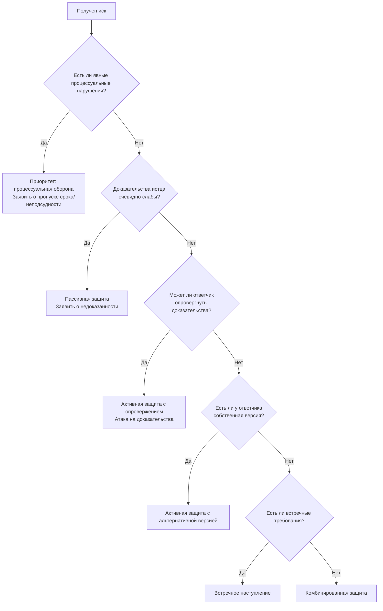

# Процессуальная тактика

**Назначение документа:** настоящий документ содержит формализованные алгоритмы тактических действий в судебном процессе: выбор стратегии защиты, применение процессуальных инструментов, работа с доказательствами, взаимодействие с судом и оппонентом. Документ не содержит шаблонов документов — только методологию.

---

## Глава 1. Общие принципы процессуальной тактики

### 1.1. Основные постулаты

| № | Постулат | Содержание |
| :--- | :--- | :--- |
| 1 | **Письменная фиксация** | Всё, что не зафиксировано в письменных документах и не приобщено к делу, для суда не существует. Устные заявления без письменного подтверждения не имеют доказательственной ценности. |
| 2 | **Активная позиция** | Суд не восполняет пробелы в доказывании по своей инициативе (за редкими исключениями). Сторона должна самостоятельно заявлять ходатайства, представлять доказательства, истребовать документы. |
| 3 | **Упреждающее действие** | Процессуальные действия следует совершать как можно раньше — до того, как оппонент займёт выгодную позицию или суд примет промежуточное решение. |
| 4 | **Множественность инструментов** | Не следует полагаться на один процессуальный инструмент. Эффективная защита использует одновременно несколько: возражения, ходатайства, жалобы в надзорные органы, встречные иски. |
| 5 | **Контроль сроков** | Процессуальные сроки — это «период полураспада» ваших прав. Пропуск срока может быть невосполним (особенно в АПК — предельный срок восстановления 6 месяцев). |

### 1.2. Распределение бремени доказывания (напоминание)

| Сторона | Обязанность | Процессуальное последствие недоказывания |
| :--- | :--- | :--- |
| **Истец** | Доказать каждое обстоятельство, образующее основание иска | Отказ в удовлетворении иска |
| **Ответчик** | Доказать каждое обстоятельство, на которое ссылается в возражениях | Удовлетворение иска (при наличии у истца минимальных доказательств) |

**Тактический вывод для ответчика:** не нужно доказывать свою правоту во всём. Достаточно «обрушить» одно ключевое обстоятельство истца — и иск рухнет полностью.

### 1.3. Принцип распределения тактических ролей

| Роль | Задача | Инструменты |
| :--- | :--- | :--- |
| **Архитектор** (проектирует) | Определяет целевую модель правовой реальности и стратегию её достижения | Правовая позиция, целевой вывод, иерархия триад |
| **Строитель** (собирает) | Формирует доказательственную базу, подбирает нормы, строит триады | Ходатайства об истребовании, запросы, сбор документов |
| **Контролёр** (проверяет) | Оценивает надёжность доказательств, проверяет уязвимость позиции | Анализ доказательств по 4 критериям, стресс-тест триад |
| **Боец** (реализует) | Представляет позицию в суде, реагирует на действия оппонента | Отзыв на иск, ходатайства, устные выступления, возражения |

---

## Глава 2. Тактика защиты (ответчик)

### 2.1. Стратегии защиты

| Стратегия | Когда применять | Суть | Риски |
| :--- | :--- | :--- | :--- |
| **Пассивная защита** | Иск явно необоснован, истец не представил доказательств | Ограничиться заявлением о недоказанности иска, не представляя собственных доказательств | Если суд сочтёт доказательства истца достаточными — проигрыш |
| **Активная защита с опровержением** | Истец представил доказательства, но они могут быть оспорены | Атака на доказательства истца по 4 критериям (относимость, допустимость, достоверность, достаточность) | Требует тщательной подготовки |
| **Активная защита с альтернативной версией** | У ответчика есть собственная версия событий | Представление собственных доказательств и альтернативной квалификации | Ответчик принимает на себя бремя доказывания |
| **Встречное наступление** | У ответчика есть встречные требования к истцу | Подача встречного иска | Увеличивает сложность процесса, требует дополнительных ресурсов |
| **Частичное признание** | Часть требований обоснована, часть — нет | Признать обоснованную часть, оспаривать необоснованную | Риск, что суд распространит признание на весь иск |
| **Процессуальная оборона** | Есть процессуальные нарушения (подсудность, срок давности, полномочия истца) | Заявление о пропуске срока, о неподсудности, об отсутствии полномочий | Может быть воспринято как уход от существа спора |

### 2.2. Алгоритм выбора стратегии защиты

### 2.3. Процессуальная оборона: ключевые приёмы

| Приём                                  | Основание                             | Когда заявлять                                               | Последствие                                            |
| :------------------------------------- | :------------------------------------ | :----------------------------------------------------------- | :----------------------------------------------------- |
| **О пропуске срока исковой давности**  | Ст. 199 ГК РФ                         | В отзыве на иск или в предварительном заседании              | Отказ в иске без исследования иных обстоятельств       |
| **О неподсудности**                    | Ст. 33 ГПК РФ, ст. 39 АПК РФ          | До принятия иска к производству или в предварительном заседании | Передача дела в другой суд                             |
| **О ненадлежащем истце**               | Ст. 45 ГПК РФ (прокурор), общие нормы | В отзыве на иск                                              | Прекращение производства / оставление без рассмотрения |
| **О несоблюдении досудебного порядка** | Ст. 132 ГПК РФ, ст. 4 АПК РФ          | В отзыве на иск                                              | Возврат иска / оставление без рассмотрения             |

**Важное примечание о сроке исковой давности:**

Суд применяет срок исковой давности **только по заявлению стороны в споре**. Если ответчик не заявит о пропуске срока, суд рассмотрит дело по существу, даже если срок явно пропущен.

### 2.4. Атака на доказательства истца (4 критерия)

| Критерий          | Вопрос                                                       | Основания для атаки                                          | Тактический приём                               |
| :---------------- | :----------------------------------------------------------- | :----------------------------------------------------------- | :---------------------------------------------- |
| **Относимость**   | Подтверждает ли доказательство факты, входящие в предмет доказывания? | Доказательство подтверждает иные обстоятельства, не имеющие значения для дела | Заявить, что доказательство не относится к делу |
| **Допустимость**  | Получено ли доказательство законным способом?                | Нет подписи, нет печати, нет заверения, получено без извещения другой стороны | Ходатайствовать об исключении доказательства    |
| **Достоверность** | Соответствует ли доказательство действительности?            | Противоречит другим доказательствам, официальным данным, содержит ошибки | Представить опровергающие доказательства        |
| **Достаточность** | Достаточно ли доказательства (или их совокупности) для вывода? | Одно доказательство, косвенные доказательства, отсутствие подтверждения | Заявить о недостаточности доказательств         |

### 2.5. Работа с экспертным заключением (если назначено)

| Ситуация                                  | Действие                                                     |
| :---------------------------------------- | :----------------------------------------------------------- |
| Экспертиза подтверждает позицию ответчика | Активно ссылаться на заключение, цитировать выводы, подчёркивать компетентность эксперта |
| Экспертиза не в пользу ответчика          | Проверить: предупреждён ли эксперт об ответственности (ст. 307 УК РФ); описаны ли методы; нет ли внутренних противоречий; не вышел ли эксперт за пределы компетенции (правовые выводы). Подготовить письменные возражения, заявить ходатайство о допросе эксперта |
| Экспертиза проведена с нарушениями        | Заявить ходатайство о назначении повторной экспертизы        |

---

## Глава 3. Тактика наступления (истец)

### 3.1. Стратегии наступления

| Стратегия                       | Когда применять                                              | Суть                                                         | Риски                                                        |
| :------------------------------ | :----------------------------------------------------------- | :----------------------------------------------------------- | :----------------------------------------------------------- |
| **Прямая атака**                | Доказательства бесспорны, ответчик не оспаривает основные факты | Иск с минимальным объёмом доказательств, расчёт на быстрое решение | При оспаривании — слабая позиция                             |
| **Документальная осада**        | Требуется собрать доказательства, находящиеся у ответчика или третьих лиц | Активное истребование доказательств через суд                | Затягивание процесса                                         |
| **Обеспечительная атака**       | Есть риск, что ответчик скроет имущество до решения суда     | Одновременно с иском — ходатайство об обеспечительных мерах  | Ответчик может обжаловать, потребовать встречного обеспечения |
| **Процессуальное ускорение**    | Дело не сложное, сумма небольшая                             | Ходатайство о рассмотрении в порядке упрощённого производства (если цена иска до 250 000 руб.) | Нет устных прений, ограничено право на дополнительные доказательства |
| **Предварительное обеспечение** | Спор об авторских правах (специфический случай)              | Обеспечительные меры до подачи иска                          | Строго ограниченный перечень случаев                         |

### 3.2. Обеспечительные меры: когда и какие

**Основание:** ст. 139 ГПК РФ, ст. 90 АПК РФ — если непринятие мер может затруднить или сделать невозможным исполнение решения.

| Мера                                                 | Когда применять                                              | Особенности                        |
| :--------------------------------------------------- | :----------------------------------------------------------- | :--------------------------------- |
| **Наложение ареста на имущество**                    | Ответчик может продать, подарить, переоформить имущество     | Нужно указать конкретное имущество |
| **Запрет регистрационных действий**                  | Спор о недвижимости, ответчик может переоформить право       | Направляется в Росреестр           |
| **Запрет ответчику совершать определённые действия** | Ответчик может уничтожить предмет спора или ухудшить его состояние | Требует обоснования                |
| **Приостановление реализации имущества**             | Иск об освобождении имущества от ареста                      | Специфический случай               |

**Тактические рекомендации:**

1. Подавать ходатайство об обеспечении **одновременно с иском** или сразу после его принятия.
2. Обосновать, почему непринятие мер сделает исполнение невозможным (например: «ответчик уже предпринимает действия по отчуждению имущества»).
3. Указать конкретное имущество, подлежащее аресту (кадастровый номер, адрес).
4. В АПК возможно требование встречного обеспечения — быть готовым внести денежную сумму на счёт суда.

---

## Глава 4. Тактика работы с судом

### 4.1. До судебного заседания

| Действие                                              | Срок                                     | Цель                                                         |
| :---------------------------------------------------- | :--------------------------------------- | :----------------------------------------------------------- |
| **Направить отзыв на иск**                            | До предварительного заседания            | Зафиксировать позицию, чтобы судья ознакомился с ней до заседания |
| **Заявить ходатайства об истребовании доказательств** | Как можно раньше                         | Получить необходимые документы до основного заседания        |
| **Заявить о пропуске срока исковой давности**         | В отзыве или в предварительном заседании | Исключить рассмотрение дела по существу                      |
| **Ознакомиться с материалами дела**                   | После принятия иска                      | Узнать, какие документы есть у суда и истца                  |
| **Подготовить письменные пояснения**                  | До заседания                             | Систематизировать позицию                                    |

### 4.2. В судебном заседании

| Ситуация                                                     | Тактика                                                      |
| :----------------------------------------------------------- | :----------------------------------------------------------- |
| **Судья не даёт высказаться**                                | Вежливо напомнить: «Уважаемый суд, прошу предоставить возможность изложить позицию по данному вопросу». В протокол занести возражения. |
| **Судья задаёт наводящие вопросы**                           | Отвечать по существу, но если вопросы явно необъективны — зафиксировать в протоколе. Апелляция — не место для эмоций. |
| **Оппонент перебивает**                                      | Обратиться к суду: «Уважаемый суд, прошу предоставить возможность закончить выступление без перебиваний». |
| **Оппонент представляет новые доказательства в последний момент** | Заявить ходатайство об отложении заседания для ознакомления. Если суд отказывает — зафиксировать возражения в протоколе. |
| **Суд отказывает в ходатайстве**                             | Не спорить. Заявить, что оставляете вопрос на усмотрение суда. Письменно зафиксировать отказ в протоколе для возможного обжалования. |
| **Суд предлагает заключить мировое соглашение**              | Оценить условия. Если условия приемлемы — соглашаться. Если нет — вежливо отказаться, объяснив причины. |

### 4.3. Протокол судебного заседания

**Почему это важно:** протокол — единственное доказательство того, что происходило в заседании. Без него апелляция бессмысленна.

| Действие                         | Когда                                                        |
| :------------------------------- | :----------------------------------------------------------- |
| **Ознакомиться с протоколом**    | В течение 5 дней после заседания                             |
| **Подать замечания на протокол** | Если протокол неполный или неточный — в течение 5 дней после ознакомления |
| **Что фиксировать в замечаниях** | Неотражённые ходатайства, неотражённые возражения, неверное изложение показаний |

**Пример замечания на протокол:** «В протоколе от [дата] не отражено ходатайство ответчика о приобщении дополнительных доказательств, заявленное в ходе судебного заседания. Прошу дополнить протокол указанием на данное ходатайство».

### 4.4. Работа с судьёй: что можно и что нельзя

| Можно                                  | Нельзя                                                       |
| :------------------------------------- | :----------------------------------------------------------- |
| Обращаться «Уважаемый суд»             | Обращаться «Ваша честь» (не принято в гражданском процессе)  |
| Заявлять ходатайства и отводы          | Оскорблять судью или критиковать его лично                   |
| Ссылаться на законы и практику         | Давить на судью («вы обязаны», «верховный суд разъяснил иначе» — можно, но без императива) |
| Фиксировать нарушения в протоколе      | Угрожать жалобами в ЕСПЧ или квалификационную коллегию       |
| Подавать частные жалобы на определения | Перебивать судью                                             |

---

## Глава 5. Тактика взаимодействия с оппонентом

### 5.1. Досудебная переписка

| Действие                             | Цель                                                   | Тактика                                                      |
| :----------------------------------- | :----------------------------------------------------- | :----------------------------------------------------------- |
| **Направить претензию**              | Соблюдение досудебного порядка, попытка урегулирования | Чётко изложить требования, дать разумный срок (10–30 дней)   |
| **Ответить на претензию**            | Избежать дополнительных судебных расходов              | Если требования необоснованны — ответить мотивированным отказом |
| **Предложить мирное урегулирование** | Экономия времени и судебных расходов                   | Предложить конкретные условия, сослаться на возможные судебные издержки |
| **Запросить документы**              | Получение информации для подготовки к суду             | Направить запрос в порядке ст. 57 ГПК РФ (через суд, если добровольно не дают) |

### 5.2. В судебном заседании

| Ситуация                                                    | Тактика                                                      |
| :---------------------------------------------------------- | :----------------------------------------------------------- |
| **Оппонент не является в заседание**                        | Если извещён надлежаще — ходатайствовать о рассмотрении дела в его отсутствие. Если не извещён — требовать отложения. |
| **Оппонент затягивает процесс**                             | Заявлять ходатайства об ускорении рассмотрения дела, обращаться к председателю суда. |
| **Оппонент представляет фальсифицированные доказательства** | Заявить о фальсификации доказательства (ст. 186 ГПК РФ), ходатайствовать об исключении, о назначении экспертизы. |
| **Оппонент ссылается на недействующие нормы**               | Указать суду, что норма утратила силу, представить доказательства. |

### 5.3. Медиация и примирительные процедуры

**Когда стоит соглашаться:**

- Высокая вероятность проигрыша в суде.
- Затраты на судебный процесс превышают размер требований.
- Необходимо сохранить деловые отношения с оппонентом.
- Оппонент предлагает разумные условия.

**Когда не стоит соглашаться:**

- Позиция бесспорна, шанс на победу высок.
- Оппонент недобросовестен (вероятность неисполнения условий).
- Требуется прецедентное решение (например, для других аналогичных споров).

---

## Глава 6. Тактика работы с доказательствами

### 6.1. Классификация доказательств по силе

| Уровень            | Тип доказательства                                    | Пример                              | Тактика                                            |
| :----------------- | :---------------------------------------------------- | :---------------------------------- | :------------------------------------------------- |
| **Высший**         | Письменные доказательства из государственных реестров | Выписка ЕГРН, свидетельство о праве | Использовать как основу позиции                    |
| **Высокий**        | Письменные доказательства от контрагентов             | Договоры, акты, счета               | Проверить подписи, полномочия                      |
| **Средний**        | Заключения экспертов (судебные)                       | Экспертиза, назначенная судом       | Использовать, но быть готовым к атаке              |
| **Средний-низкий** | Фотографии, видеозаписи                               | Съёмка с геотегами                  | Оформить надлежащим образом (дата, место, подпись) |
| **Низкий**         | Показания свидетелей                                  | Устные показания                    | Подкреплять письменными доказательствами           |
| **Минимальный**    | Объяснения сторон                                     | «Я не согласен»                     | Без письменного подтверждения — бесполезно         |

### 6.2. Порядок представления доказательств

| Этап | Действие                                                     | Срок         |
| :--- | :----------------------------------------------------------- | :----------- |
| 1    | Подготовить доказательство в надлежащей форме (оригинал или заверенная копия) | До подачи    |
| 2    | Составить ходатайство о приобщении доказательств (или включить в отзыв) | До заседания |
| 3    | Направить копии доказательств другой стороне (с доказательством направления) | До заседания |
| 4    | Подать оригиналы в суд (или заявить, что будут представлены по требованию) | В заседании  |
| 5    | В судебном заседании устно поддержать ходатайство            | В заседании  |

### 6.3. Что делать, если доказательство находится у другой стороны или в госоргане

| Ситуация                                                | Действие                                                     |
| :------------------------------------------------------ | :----------------------------------------------------------- |
| Доказательство у истца, но он не даёт                   | Ходатайство об истребовании доказательств (ст. 57 ГПК РФ)    |
| Доказательство в государственном органе                 | Направить запрос самостоятельно. При отказе — ходатайство об истребовании |
| Доказательство у третьего лица, не обязанного давать    | Ходатайство об истребовании                                  |
| Доказательство существует, но сторона не знает, где оно | Ходатайство о содействии в получении доказательств           |

### 6.4. Форма и содержание ходатайства об истребовании доказательств

| Элемент                            | Что указать                                                  |
| :--------------------------------- | :----------------------------------------------------------- |
| **Какое доказательство нужно**     | Конкретное наименование документа                            |
| **Где находится**                  | Точный адрес, наименование органа                            |
| **Почему не можете получить сами** | «Обратились с запросом, получили отказ» или запросили, но ответ не получен в течение 30 дней |
| **Какие факты подтверждает**       | Связь с предметом спора                                      |

---

## Глава 7. Тактика апелляционного обжалования

### 7.1. Когда подавать апелляционную жалобу

| Ситуация                                                     | Решение                                                      |
| :----------------------------------------------------------- | :----------------------------------------------------------- |
| Суд неправильно применил нормы материального права           | Подавать жалобу                                              |
| Суд неправильно оценил доказательства                        | Подавать жалобу (но нужно показать, почему оценка была неверной) |
| Суд не исследовал важные доказательства                      | Подавать жалобу (указать, какие доказательства и почему важны) |
| Суд нарушил процессуальные нормы (не известил, не приобщил доказательства) | Подавать жалобу (это безусловные основания для отмены)       |
| Суд вынес правильное решение, но вы с ним не согласны по существу | Не подавать (бесполезно)                                     |

### 7.2. Сроки и их исчисление

| Правило                           | По ГПК РФ                                     | По АПК РФ                                          |
| :-------------------------------- | :-------------------------------------------- | :------------------------------------------------- |
| Срок подачи                       | 1 месяц                                       | 1 месяц                                            |
| От какой даты исчисляется         | Со дня принятия решения в окончательной форме | Со дня принятия решения в окончательной форме      |
| Восстановление пропущенного срока | При уважительных причинах                     | При уважительных причинах, но не позднее 6 месяцев |

**Критическое различие:** в арбитражном процессе (АПК) предельный срок восстановления — 6 месяцев со дня принятия решения. В ГПК формально не ограничен, но на практике суды редко восстанавливают срок свыше 6 месяцев без исключительных обстоятельств.

### 7.3. Что можно требовать в апелляции

| Требование                      | Возможность                                                  |
| :------------------------------ | :----------------------------------------------------------- |
| Отменить решение полностью      | Да                                                           |
| Отменить решение в части        | Да                                                           |
| Изменить решение                | Да                                                           |
| Прекратить производство по делу | Да (при наличии оснований)                                   |
| Принять новое решение           | Да                                                           |
| Приобщить новые доказательства  | Да, но только если уважительная причина, почему не представили в первой инстанции |

**Что нельзя делать:** заявлять новые требования, которые не были предметом рассмотрения в суде первой инстанции.

### 7.4. Дополнительные доказательства в апелляции

| Основание для принятия                                  | Пример                                                     |
| :------------------------------------------------------ | :--------------------------------------------------------- |
| Доказательство появилось после вынесения решения        | Новая экспертиза, новый документ                           |
| Суд первой инстанции необоснованно отказал в приобщении | Есть определение суда об отказе                            |
| Сторона не могла получить доказательство ранее          | Документ находился в госоргане, ответ пришёл после решения |
| Суд не известил сторону о заседании                     | Сторона не участвовала в процессе первой инстанции         |

**Что не примут:** доказательства, которые можно было представить в первой инстанции, но сторона этого не сделала без уважительной причины.

---

## Глава 8. Типовые тактические ошибки

| №    | Ошибка                                                       | Последствие                                       | Как избежать                                                 |
| :--- | :----------------------------------------------------------- | :------------------------------------------------ | :----------------------------------------------------------- |
| 1    | **Молчание в суде** («судья сам всё увидит»)                 | Судья рассматривает только доказательства истца   | Подавать письменные возражения, заявлять ходатайства         |
| 2    | **Эмоциональные выступления вместо аргументов**              | Судья не воспринимает позицию всерьёз             | Излагать факты и нормы, без оценок                           |
| 3    | **Полагание на один процессуальный инструмент**              | Если он не сработает — позиция рушится            | Использовать несколько инструментов одновременно             |
| 4    | **Пропуск процессуальных сроков**                            | Утрата права на совершение действия               | Контролировать сроки, заявлять о восстановлении при пропуске |
| 5    | **Несвоевременное заявление о пропуске срока исковой давности** | Суд рассмотрит дело по существу                   | Заявить в отзыве или в предварительном заседании             |
| 6    | **Отсутствие письменной фиксации ходатайств**                | Суд может «забыть» рассмотреть устное ходатайство | Все ходатайства подавать в письменной форме                  |
| 7    | **Неподготовленность к допросу эксперта**                    | Нельзя выявить слабые места заключения            | Подготовить вопросы заранее                                  |
| 8    | **Игнорирование протокола судебного заседания**              | Невозможно доказать нарушения в апелляции         | Ознакомиться, подать замечания                               |

---

## Глава 9. Контрольный чек-лист для каждого этапа процесса

### 9.1. После получения иска

- [ ] Проверена подсудность.
- [ ] Проверен срок исковой давности.
- [ ] Проверены полномочия истца (особенно прокурора).
- [ ] Проанализированы требования, нормы, факты, доказательства истца.
- [ ] Выявлены точки для атаки (3–7).
- [ ] Подготовлен отзыв на иск (письменно).
- [ ] Отзыв направлен в суд и другой стороне.
- [ ] Заявлено о пропуске срока исковой давности (если применимо).
- [ ] Заявлены ходатайства об истребовании доказательств (если нужно).

### 9.2. В ходе процесса

- [ ] Все ходатайства поданы в письменной форме.
- [ ] Доказательства приобщены к делу.
- [ ] Копии доказательств направлены другой стороне.
- [ ] Протокол судебного заседания проверен (после каждого заседания).
- [ ] Замечания на протокол поданы (при необходимости).

### 9.3. После вынесения решения

- [ ] Решение получено (ознакомление с мотивированным решением).
- [ ] Срок на апелляцию исчислен (с даты изготовления мотивированного решения).
- [ ] Проведён анализ: есть ли основания для апелляции.
- [ ] При наличии оснований — подготовлена и подана апелляционная жалоба.
- [ ] При пропуске срока — подано заявление о восстановлении срока.

### 9.4. После вступления решения в силу

- [ ] Если решение в вашу пользу — получен исполнительный лист.
- [ ] Исполнительный лист предъявлен к исполнению (приставам или в банк).
- [ ] Контролируется ход исполнительного производства.
- [ ] Если решение не в вашу пользу — обеспечено его исполнение (если возможно) или подана кассационная жалоба.

---

*Конец документа*